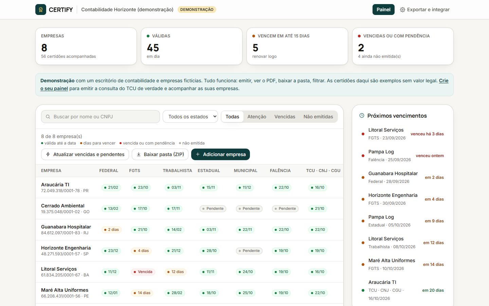
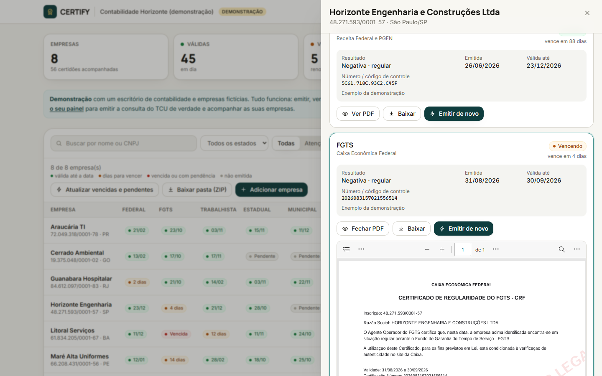
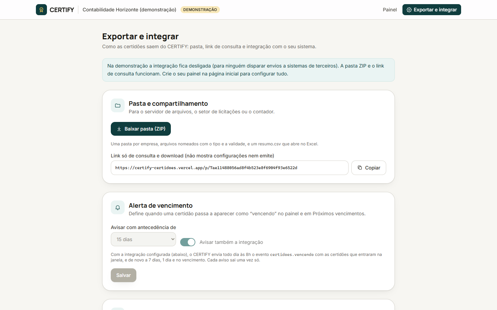

# CERTIFY · certidões em dia

   

**🔗 Demo ao vivo: [certify-certidoes.vercel.app](https://certify-certidoes.vercel.app)** · painel de exemplo em [/demo](https://certify-certidoes.vercel.app/demo) · ou crie o seu painel na página inicial (sem cadastro).



Informe o CNPJ e acompanhe, num painel só, as certidões fiscais e jurídicas que licitações, bancos e clientes pedem: **Federal (Receita/PGFN), FGTS, Trabalhista (TST), Estadual, Municipal, Falência (TJ) e a consulta consolidada do TCU**. O CERTIFY destaca o que está para vencer e exporta os PDFs em pasta ZIP, link de consulta ou integração com o sistema interno.

| Certidão aberta no painel | Exportar e integrar |
| --- | --- |
|  |  |

---

## O que faz

| | |
| --- | --- |
| **CNPJ → empresa** | Razão social, UF e município vêm do cadastro público (BrasilAPI, com reserva na CNPJ.ws). O painel já sabe qual SEFAZ, prefeitura e TJ procurar |
| **Painel** | Grade empresa × certidão com a situação de cada uma (válida, vencendo, vencida, com pendência, não emitida), filtro por **estado**, situação e busca |
| **Emissão** | Automática quando existe canal aberto; assistida quando o órgão exige CAPTCHA (ver abaixo) |
| **Leitura do PDF** | O PDF oficial enviado é lido sozinho: tipo, resultado (negativa / positiva com efeitos de negativa / positiva), número ou código de controle, emissão e validade. Recusa PDF de outro CNPJ |
| **Visualizar** | PDF aberto na própria ferramenta, histórico de todas as emissões |
| **Alertas** | Janela de renovação configurável (5 a 60 dias): o painel destaca o que vence e lista os próximos vencimentos. Com integração, o sistema recebe o aviso todo dia às 8h — na janela, a 7 dias, 1 dia e no vencimento, cada um uma vez só |
| **Pasta** | ZIP com uma pasta por empresa, arquivos nomeados pela validade e um `resumo.csv` que abre no Excel |
| **Link de consulta** | Um segundo link, só de leitura e download, para o contador, o cliente ou o setor de licitações |
| **Integração** | Webhook `POST` a cada certidão nova (com o PDF) e a cada aviso de vencimento, assinado com HMAC-SHA256 (`X-Certify-Assinatura`), para o sistema jurídico, ERP ou GED |

## Emissão: o que é automático e por quê

Nenhuma dessas certidões exige login ou certificado digital — só o CNPJ. Mas Receita, Caixa, TST, SEFAZ e prefeituras põem **CAPTCHA** antes de emitir. O CERTIFY **não tenta burlar** essa proteção. Em vez disso:

| Rota | Quando | Como |
| --- | --- | --- |
| **TCU (automática)** | Consulta consolidada: inidôneos (TCU), improbidade (CNJ), CEIS e CNEP | Serviço público aberto, devolve o PDF oficial. O TCU tem firewall: o CERTIFY limita o próprio ritmo (teto global por hora, reaproveita a mesma certidão por 24 h) e, se for bloqueado, cai para a emissão assistida em vez de insistir |
| **Assistida** | Órgãos com CAPTCHA | Abre o site oficial certo (com o CNPJ copiado); a pessoa envia o PDF e o CERTIFY lê tudo |
| **Infosimples (automática, opcional)** | Com `INFOSIMPLES_TOKEN` | Conector de um provedor autorizado emite Federal, FGTS, Trabalhista e Estadual. O PDF devolvido passa pela mesma leitura das certidões enviadas à mão |
| **Demonstração** | Painel `/demo` | Certidões de **exemplo**, com marca d'água “sem valor legal”, para empresas fictícias. A demo não aceita empresas reais |

> O conector Infosimples foi escrito a partir da documentação pública e **não foi testado com uma chave real**; os caminhos de cada consulta podem ser ajustados em `INFOSIMPLES_CONSULTAS` sem mudar código.

## Arquitetura

```
Navegador ──► Next.js 15 (App Router, Route Handlers)
                 │
                 ├─► BrasilAPI / CNPJ.ws ........ dados do CNPJ
                 ├─► TCU (API pública) ........... consulta consolidada em PDF
                 ├─► Infosimples (opcional) ...... demais certidões
                 ├─► Webhook do cliente .......... certidões novas e avisos de vencimento (HMAC)
                 └─► Supabase Postgres (schema "certidoes", só via funções com segredo)
                          ▲
       pg_cron + pg_net ──┘  de hora em hora → /api/agendador (avisos de vencimento às 8h, demo às 3h)
```

- **Sem login, com link secreto**: cada painel tem um token de 144 bits (administração) e outro de leitura. As rotas conferem que cada empresa e certidão pertencem ao painel do link.
- **Banco fechado**: tabelas no schema `certidoes`, fora da API REST. O acesso é só por funções `public.certify_*` que exigem `CERTIFY_SEGREDO`. PDFs guardados no próprio banco (`bytea`).
- **Limites persistentes** (a Vercel pode atender cada requisição em outra instância): criação de painéis por IP, consultas de CNPJ, emissões por painel e teto global de chamadas ao TCU — tudo com hash de IP, nunca o IP.
- **Agendamento de hora em hora sem plano pago**: o cron da Vercel gratuita é diário; o `pg_cron` do Supabase chama a rota via `pg_net`.
- **Webhook seguro**: só `https`, bloqueia endereços internos (localhost, redes privadas), sem seguir redirecionamentos, 10 s de limite.

```
src/lib/
├── catalogo.ts        # certidões: órgão, validade usual, link oficial por UF/município
├── leitura.ts         # leitura do PDF (tipo, resultado, número, emissão, validade, CNPJ) — testada
├── situacao.ts        # válida / vencendo / vencida / pendência — testada
├── emissores/         # tcu · infosimples · demo · roteamento
├── entrega/           # webhook (HMAC) e ZIP (fflate)
├── agendador.ts       # avisos de vencimento + demo
└── pdf-demo.ts        # certidões de exemplo no formato de cada órgão (pdf-lib)
```

## Como rodar

```bash
npm install
# banco: aplique supabase/migrations/*.sql (o 000300 precisa da URL do app e do CRON_SECRET)
cp .env.example .env.local
npm run dev        # http://localhost:3400  →  /demo cria a demonstração
npm test           # CNPJ, situação e leitura de PDFs (inclui um PDF real do TCU)
node scripts/fluxo.e2e.mjs http://localhost:3400   # fluxo completo pela API
```

## Limitações conhecidas

- **Estadual e municipal** variam por UF e por prefeitura (são mais de 5.500 municípios). O link aponta para o site oficial de SP; nos demais casos, abre a busca pelo órgão certo.
- **TJ fora de SP**: formatos de certidão de falência variam; o PDF é lido, mas a validade pode vir estimada (marcada como “usual” no painel).
- **Sem login**: quem tem o link administra o painel. Para uso comercial, o próximo passo é autenticação por e-mail e papéis (admin / leitura).
